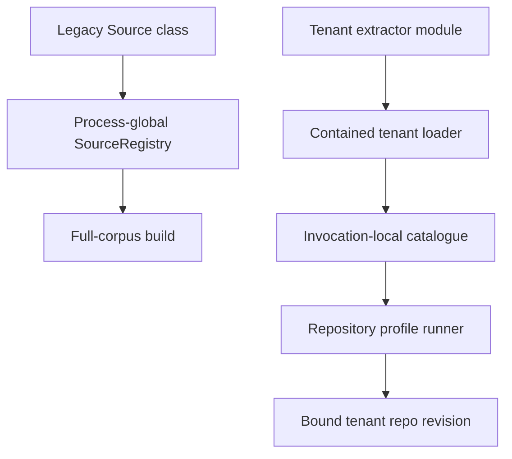

# Cloud-Native KB Ingestion — Custom Sources

> **Status — operational model.** This guide explains both the legacy full-corpus `SourceRegistry` contract and the repository-profile extractor contract used by multi-tenant pull ingestion. A runnable legacy Source ships alongside this guide under [`ai/examples/cloud-deployment/`](../../../ai/examples/cloud-deployment/).

> **Compatibility boundary.** `SourceRegistry` is the mutable legacy surface for the
> full-corpus extract-all path. The repository-profile kernel does not consult it: built-in
> extractors come from an immutable descriptor catalogue, and tenant-declared extractors resolve
> per invocation. Keep existing registry integrations working while that legacy path is live, but
> do not register a new multi-tenant extractor globally.

## Source vs Parser — which do you need?

The KB ingestion substrate splits content acquisition into two roles (see [Overview](./Overview.md)):

- A **Source** locates and reads content from a *territory* it can see on disk — a directory tree, a co-located repo — and feeds it into the **full-corpus build** (`npm run ai:sync-kb`).
- A **Parser** transforms one file *format* into chunk content for the **push path** (`ingest_source_files`, `ai:ingest-tenant`). See [Custom Parsers](./CustomParsers.md).

Push and pull need different extension shapes. A tenant pushing content to a remote KB server uses parsers plus `parsed-chunk-v1`. A deployment pulling repositories uses extraction profiles and immutable extractor descriptors. The older `Source` class below still matters to deployments running the legacy full-corpus build; it is not the registration mechanism for a new multi-tenant pull extractor.



## The Source contract

A Source is a Neo class extending [`source/Base.mjs`](../../../ai/services/knowledge-base/source/Base.mjs). It implements one abstract method:

```
async extract(writeStream, createHashFn) : Promise<Number>
```

`extract` traverses its territory, builds a chunk record per unit of content, writes each as one JSON line to `writeStream`, and returns the number of chunks written. The full-corpus build (`DatabaseService.createKnowledgeBase`) calls `extract` on every registered Source in turn.

Each chunk record carries the indexable content plus the metadata the KB ranks on — the shape Neo's built-in Sources emit (see `AdrSource` for the canonical precedent):

| Field | Meaning |
|---|---|
| `type` | Coarse content category — e.g. `proto`, `guide`, `src`. |
| `kind` | Finer semantic category — e.g. `schema`, `method`, `doc-section`. |
| `name` | Human-readable chunk name. |
| `content` | The chunk text — embedded server-side. |
| `source` | The chunk's source path. |

Set `chunk.hash = createHashFn(chunk)` before writing each record. `createHashFn` is the content-hash function the build supplies; it folds the tenant identity (`tenantId`, `repoSlug`) into the hash **automatically** — a custom Source does not thread tenant fields itself (see *Identity-tuple semantics* below).

> The `extract` path is the full-corpus build's chunk contract. It is distinct from the `parsed-chunk-v1` *push* contract in [Custom Parsers](./CustomParsers.md): `parsed-chunk-v1` is the shape a tenant pushes through `ingest_source_files` / `ai:ingest-tenant`, whereas `extract` chunks are produced in-process by the full-corpus build. The two are separate ingestion paths into the same `knowledge-base` collection.

## Authoring a custom Source

A minimal Source — modelled on the built-in `AdrSource` — that indexes a tenant's `.proto` schema files:

```js
import Base     from './Base.mjs';
import fs       from 'fs-extra';
import path     from 'path';
import aiConfig from '../../../mcp/server/knowledge-base/config.mjs';

/**
 * @summary Extracts knowledge chunks from a tenant's `.proto` schema files.
 * @class MyOrg.kb.source.ProtoSource
 * @extends Neo.ai.services.knowledge-base.source.Base
 * @singleton
 */
class ProtoSource extends Base {
    static config = {
        className: 'MyOrg.kb.source.ProtoSource',
        singleton: true
    }

    async extract(writeStream, createHashFn) {
        let count = 0;
        // Path resolves from aiConfig.sourcePaths; the config leaf owns the default.
        const dir = path.resolve(aiConfig.neoRootDir, aiConfig.sourcePaths.ProtoSource);

        if (await fs.pathExists(dir)) {
            for (const file of (await fs.readdir(dir)).sort()) {
                if (!file.endsWith('.proto')) continue;

                const filePath = path.join(dir, file);
                const chunk    = {
                    type   : 'proto',
                    kind   : 'schema',
                    name   : path.basename(file, '.proto'),
                    content: (await fs.readFile(filePath, 'utf-8')).trim(),
                    source : path.relative(aiConfig.neoRootDir, filePath)
                };

                chunk.hash = createHashFn(chunk);
                writeStream.write(JSON.stringify(chunk) + '\n');
                count++;
            }
        }

        return count;
    }
}

export default Neo.setupClass(ProtoSource);
```

Sort the territory deterministically (`.sort()` above) so the generated corpus is byte-stable run-to-run.

## Registering a legacy full-corpus Source

A Source class is registered in the `SourceRegistry` singleton under a stable name:

- **Declaratively** — add it to `aiConfig.customSources` as `{SourceClass, sourceName?}` (loaded once at boot). `sourceName` defaults to the class's `className` final segment (`ProtoSource` above).
- **Programmatically** — `SourceRegistry.registerSource(ProtoSource, {sourceName: 'ProtoSource'})` at runtime; re-registering the same name overwrites (idempotent, useful for hot-reload).

`aiConfig.useDefaultSources` (default `true`) controls whether Neo's 10 curated Source classes are also registered. A deployment indexing *only* tenant content sets it `false`; the registry then contains only the tenant's custom Sources. See [Configuration](./Configuration.md).

This registry remains mutable for compatibility: the current full-corpus builder still enumerates
it, and freezing or removing it before that consumer cuts over would break a working deployment.
New repository-profile execution uses `ExtractorCatalogue` plus
`extractFromRepository({context, options, writeStream, createHashFn})` instead. That invocation is
bound to one tenant, repository, and revision; it never reads `SourceRegistry`, ambient cwd, or
process-wide path config. The legacy registry retires only after every legacy Source consumer has
ported and the tenant ingestion lane has cut over.

## Authoring a repository-profile extractor

A repository extractor is an immutable descriptor, not a globally registered class. The loaded module export owns:

- a stable `extractorId` and semantic `version`;
- `requiresHierarchy`, which declares whether execution needs the identity-bearing hierarchy capability;
- `deltaSafe`, which states whether one changed path can be materialized without replaying unchanged paths;
- `normalizeOptions(options)`, which closes and canonicalizes the route's public materialization inputs;
- `extract({context, options, writeStream, createHashFn})`, which reads only through `context.repositoryReader` and reports `{count, yieldedSourcePaths, skippedSourcePaths}`.

Tenant config declares only the module address:

```js
customExtractors: [{
    extractorModule: 'ProtoExtractor.mjs',
    exportName     : 'ProtoExtractor' // optional; default export otherwise
}]
```

The deployment pins `tenantExtractorRoot` (or `NEO_KB_TENANT_EXTRACTOR_ROOT`) to an absolute, read-only execution root. Empty means disabled. Resolution rejects absolute paths, bare packages, traversal, and realpath/symlink escape; there is no repository or cwd fallback. Built-ins assemble before tenant descriptors, and duplicate `extractorId` values fail before profile normalization, so a tenant cannot shadow a built-in.

Custom descriptors currently cannot claim `deltaSafe: true`. Arbitrary extractor code may contain hidden cross-file dependencies that a generic loader cannot prove absent, so the unsafe capability claim is rejected rather than trusted. Built-in descriptors can carry that capability when their one-file-to-one-output behavior is part of the maintained contract.

Reference the descriptor from one repository profile route:

```js
extractionProfile: {
    profileSchemaVersion: 1,
    routes: [{
        territory: {roots: ['proto'], include: ['**/*.proto'], exclude: []},
        extractorId: 'ProtoExtractor',
        options    : {}
    }],
    fallback: {action: 'exclude'}
}
```

Routes are canonicalized and evaluated as exact territory claims, not an order-dependent cascade. Descriptor version and normalized options enter extraction identity, so changing either forces a full materialization even when the Git SHA is unchanged.

## Built-in Raw Repo Fallback

Use `RawRepoSource` when a repository needs day-0 ingestion before its shape is known well enough to justify a specialized extractor. In the legacy full-corpus path, `rawRepoSource: true` registers it and `sourcePaths.RawRepoSource` controls its local walk. In pull mode, an absent profile with no declared parser synthesizes a `RawRepoSource` route: `sourcePaths.RawRepoSource.root` becomes route territory and the remaining fields become canonical route options. The pull runner still reads bytes only through its revision-bound reader.

```js
rawRepoSource: true,
useDefaultSources: false,
sourcePaths: {
    RawRepoSource: {
        root             : '.',
        includeExtensions: ['.md', '.js', '.json'],
        excludePaths     : ['.git', 'node_modules', 'dist', 'docs/output'],
        excludeExtensions: ['.png', '.jpg', '.pdf', '.woff2']
    }
}
```

Graduate from `RawRepoSource` to a custom Source when a tenant needs semantic chunking, generated-manifest boundaries, or source-specific metadata.

## Path conventions

A Source should not hard-code its territory path. Resolve it from `aiConfig.sourcePaths` keyed by the Source's registry name — `aiConfig.sourcePaths.ProtoSource` — so a deployment whose layout differs overrides only that key. Defaults belong in `config.template.mjs`, not in consumer-side optional chains. Each Source interprets its own entry shape (a string, a string-array, or a path→type object — see the built-in Source defaults in `config.template.mjs`).

## Identity-tuple semantics

Every KB chunk is owned by the path-identity tuple `{tenantId, repoSlug, rootKind, sourcePath}` (see [`identity-tuple.md`](../../../ai/services/knowledge-base/parser/identity-tuple.md)). A custom Source does **not** set `tenantId` / `repoSlug` itself:

- `createHashFn` folds `tenantId` + `repoSlug` into the content hash automatically, so byte-identical content under two tenants produces distinct chunk ids.
- The write-side server stamp applies the authoritative tenant tuple at embed time — client/Source-supplied tenant fields are never authoritative.

Neo's own curated content resolves to `tenantId: 'neo-shared'`, `repoSlug: 'neo'`, `rootKind: 'neo-workspace'` — the team namespace visible to every tenant. A custom Source emits content; the substrate stamps the identity.

## Related

- [Overview](./Overview.md) — the Source/Parser registry split and the contract layering.
- [Custom Parsers](./CustomParsers.md) — the push-path counterpart; what most cloud tenants need.
- [Hook Wiring](./HookWiring.md) — the `ingest_source_files` / `ai:ingest-tenant` push facades.
- [Configuration](./Configuration.md) — `useDefaultSources`, `customSources`, `sourcePaths`.
- [`source/Base.mjs`](../../../ai/services/knowledge-base/source/Base.mjs) — the abstract Source contract · [`identity-tuple.md`](../../../ai/services/knowledge-base/parser/identity-tuple.md) — the chunk-identity tuple.
- [`ExtractorCatalogue.mjs`](../../../ai/services/knowledge-base/source/ExtractorCatalogue.mjs) — immutable descriptor shape and built-ins · [`tenantExtractorLoader.mjs`](../../../ai/services/knowledge-base/source/tenantExtractorLoader.mjs) — tenant isolation and containment.
